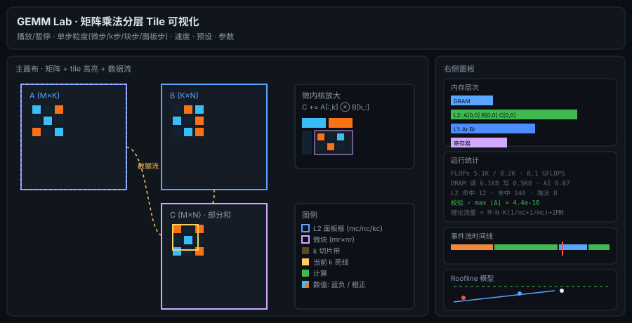

# GEMM Lab · 矩阵乘法分层 Tile 可视化

一个**真实算法 + 事件驱动回放**的矩阵乘法（GEMM）演示工程：完整展示 BLIS/Goto 风格的多层
Tile 切分（寄存器级 / L1 级 / L2 级）、数据在内存层次中的搬运（含缓存命中、LRU 淘汰、
容量受限导致的级联缺失），以及逐 k 累加的微内核乘加动画。**C 矩阵上显示的是真实的
部分和**，随 k 推进逐步收敛到朴素乘法的结果（实时校验误差）。



## 运行

零依赖、零构建，纯原生 JS + Canvas：

- 直接双击打开 `index.html`（经典 `<script>`，file:// 协议下可用）；
- 或 `python3 -m http.server` 后访问 `http://localhost:8000`。

验证模拟器核心与渲染逻辑：

- `node test/test.mjs` — 模拟器 25 项断言：数值正确性、时间序、数据搬运精确计数
  （无限缓存→强制缺失下限、无分块→最坏 2MNK、容量受限→级联缺失）、Player 计数一致性；
- `node test/dom-smoke.mjs` — DOM 桩冒烟测试：执行全部渲染/UI 代码路径
  （播放到结束、预设切换、配置面板、键盘、缩放）并断言运行状态；
- **视觉验证（无浏览器）**：`node test/svg-render.mjs` 用「Canvas2D 子集→SVG」适配器
  执行真实渲染代码输出各画布快照，`ruby test/render-svg.rb`（Fiddle 直调 CoreGraphics/
  CoreText）转成 PNG，`ruby test/png-check.rb` 解码 PNG 并对 21 项关键视觉元素
  （矩阵色块、tile 高亮框、k 亮线、微内核面板、内存驻留块、Roofline 工作点…）
  做客观像素断言。

## 核心概念

### 被模拟的算法（6 层循环，BLIS/Goto 结构，顺序可配）

6 层循环的**嵌套顺序可选**（参数条「循环序」下拉，外→内）：`i2/j2/k2/ir/jr/kr`
的全排列中合法的共 **90 种**（`ir/jr/kr` 的区间边界分别依赖 `i2/j2/k2`，必须排在其后；
非法顺序自动回退默认并提示）。每条数据请求绑定到其坐标依赖中「最内层」的循环入口
发出，任意合法顺序下事件语义正确，且命中/缺失/寄存器流量随顺序自然变化——
循环重排如何改变局部性由此可直接对比，例如 `kr` 提前到微循环之前会使
C 微块反复进出寄存器（寄存器流量 ×kc），`k2` 夹进 `i2` 与 `j2` 之间会使
C 面板被重复读写 K/kc 次。默认顺序即经典 BLIS 结构：

```
for i2 in 0..M step mc:            # C 行块 —— L2 面板
  for j2 in 0..N step nc:          # C 列块 —— L2 面板
    C(i2,j2) 载入 L2
    for k2 in 0..K step kc:        # k 块  —— L2 面板
      A(i2,k2) mc×kc 载入 L2（打包）
      B(k2,j2) kc×nc 载入 L2（打包）
      for ir in mc step mr:        # 微行 —— L1 微面板
        Ar(mr×kc) 载入 L1
        for jr in nc step nr:      # 微列 —— L1 微面板
          Br(kc×nr) 载入 L1
          for kr in kc step 1:     # 微内核（寄存器级）
            C[ir:ir+mr, jr:jr+nr] += A[:,kr] ⊗ B[kr,:]
    C(i2,j2) 写回 DRAM
```

| 参数 | 含义 | 常驻层 | 典型值 |
|---|---|---|---|
| `mc × nc` | C 面板（L2 级 tile） | L2 | 256×256 |
| `kc` | k 分块（L2 级） | — | 256 |
| `mr × nr` | 微内核（寄存器级 tile） | 寄存器 | 4×8 / 8×8 |
| `mr × kc` / `kc × nr` | 打包微面板 | L1 | — |

### 数据搬运的精确统计

**写路径与脏块**：C 面板是唯一可写数据（写分配/读改写语义，载入 L2 即脏）；
A/B 面板与 Ar/Br 微面板只读，淘汰零流量。脏块被 LRU 淘汰 = **脏替换**，
先冲刷回 DRAM（写回事件标注脏替换次数）；面板正常完成时走最终写回——
两者互斥防双计，每个 C 面板恰好写回一次（总写 == M·N·8 不变）。
**链路统计**：6 条链路（dram→l2 填充 / l2→l1 填充 / 级联 dram→l1 /
l2→reg C 微块载入 / l1→reg 操作数流 / l2→dram 写回）各自累计流量与
耗时，实测带宽 = 流量 ÷ 实际耗时（含固定延迟）——小块事务被延迟压制的
程度、分块对带宽的摊销效应直接可见；利用率 = 实测 ÷ 理论带宽，
「层次框图」面板实时呈现。

循环结构决定的**解析式**（无容量缺失时）与实际仿真一致：

```
DRAM 流量 = M·N·K·(1/nc + 1/mc) + 2·M·N   （元素）
强制缺失下限 = 2MN + MK + KN
无分块最坏 = 2·M·N·K + 2·M·N
```

面板复用次数：A 面板 ×(N/nc)，B 面板 ×(M/mc)。Roofline 图把这三个工作点画在
带宽墙（16 GB/s 斜率）与峰值墙（64 GFLOPS）之间，直观展示分块如何把工作点从
带宽受限推向计算受限。

### 模拟器架构

```
randMatrix ─┐
            ├─ buildTrace(cfg) ─→ 事件轨迹(trace) ─→ Player 回放 ─→ 渲染器
LRU 缓存模型 ┘                    {xfer/hit/evict/        ├─ C 部分和(真实累加)
(容量受限)                        oversize/reg/compute}   ├─ 热度统计
                                                          └─ 运行计数器
```

- **时间模型**：带宽 + 固定延迟 + 峰值吞吐（`BW = {DRAM 16, L2 64, L1 256, Reg 512} GB/s`，
  `LAT = {DRAM 事务 80, L2→L1 4} ns`，`PEAK = 64 GFLOPS`，float64）。
  每笔搬运事务 = `bytes/带宽 + 固定延迟`——块越小延迟占比越大，「分块摊销延迟」
  由模型自然产生（无分块的每字节 DRAM 成本约为分块的 100 倍）；记账事件
  （命中/淘汰/超容量）不占模拟时间；
- **缓存模型**：容量受限 LRU。块大于容量 → 不驻留（`oversize`），后续访问
  **级联缺失**直达 DRAM——这正是「面板必须装得进 L2」的容量约束的可视化；
- **回放节奏**：每类事件固定驻留时长（ms），总播放时长确定、可预测。

## 界面导览

| 区域 | 内容 |
|---|---|
| 伪代码 | 6 层循环逐行实时高亮（载入=蓝 / 计算=绿 / 写回=橙，行尾标注 命中✓/未中/级联/超容量/FLOP），6 个循环变量 i2/j2/k2/ir/jr/kr 当前值、轮次 x/y 与进度条实时更新 |
| 主画布 | A(左下) / B(右上) / C(右下)；青色=L2 面板框，品红=微块，琥珀=k 切片带，亮线=当前 k，虚线箭头=数据流 |
| 微内核放大 | 左上角：当前 A 列 ⊗ B 行 → C 微块，逐 k 显示真实数值累加 |
| 内存层次 | DRAM/L2/L1/寄存器驻留块、搬运飞行动画、命中✓/未中✗/淘汰/超容量反馈、容量占用条，C 块标 ✱ 为脏块 |
| 层次框图 | 层间链路框图：每条链路的流量、**实测带宽**（含延迟压制）与利用率着色，写路径标注脏替换次数，回放实时增长 |

### 并行切分（类比 CUDA block）

i2/j2 面板轴可各切为 1/2/4/8 份，每份一个并行 block——**独享一套 L1**
（id 空间独立、容量独立判定），**共享同一 L2**（跨 block 竞争面板空间）。
调度器按 k2 粒度轮转（每轮各 block 前进一个 k2 迭代），模拟多 block
并发共享 L2 的推进与竞争。切 j2 轴时 A 面板跨 block 共享 L2（B 独享）、
切 i2 轴时 B 共享（A 独享）——共享维的选择直接改变 L2 竞争模式。
K 轴切分（split-K）因引入跨 block 归约依赖暂不支持（TODO）。
块数超过面板数时自动钳制并提示。
| 运行统计 | FLOPs、各层搬运字节、算术强度、实际 GFLOPS、命中率、面板复用、理论流量公式、**实时数值校验** |
| 时间线 | 事件流堆叠图（绿=计算 橙=DRAM 蓝=L2 紫=L1），红色游标 |
| Roofline | 带宽墙/峰值墙 + 无分块·当前·理论上限·实际回放 四个工作点 |

### 预设配置

| 预设 | 说明 | 看点 |
|---|---|---|
| 小型·数值 16³ | mc=nc=kc=8, mr=nr=4 | 每个数值可见，微内核逐 k 累加 |
| 中型·分块 32³ | mc=nc=kc=16, mr=nr=4 | 多层 tile 层次完整 |
| 大型·性能 96³ | mc=nc=kc=32, mr=nr=8 | 接近真实规模，Roofline 逼近峰值 |
| 超大·256³ | mc=nc=kc=64, mr=nr=8 | 面板带宽瓶颈主导；大矩阵自动切换像素级渲染 |
| 无分块·对照 | mc=nc=kc=1 | DRAM 流量 = 最坏 2MNK（≈5.7× 于分块） |
| 缓存受限 | kc=K，L2 装不下面板 | 超容量 → 级联缺失 → B 被重复搬运 4 次 |

### 操作

- `▶/⏸` 播放暂停（`空格`）、`⏮` 重置、`⏭` 运行到结束、`→` 单步；
- 单步粒度：**微步**(1 事件) / **k 步**(1 个 k) / **块步**(1 个微块) / **面板步**(1 个 k2 面板)；
- 速度 0.25×–20×；**参数条常驻**于顶栏下方，可改矩阵尺寸、tile 尺寸
  （mc/nc/kc 共用同一 kc：A 面板 mc×kc 与 B 面板 kc×nc 必须对齐同一收缩维）、
  **循环序（90 种合法嵌套）**、**并行切分（i2/j2 轴 block 数）**、
  缓存容量、随机种子，「应用配置」生效；
- C 视图可切换「数值(部分和) / 访问热度」。

## 真实性与简化

真实的部分：循环结构与 BLIS 一致、搬运量解析式精确、C 为真实累加且与朴素乘法
逐格校验、命中/淘汰由容量模型判定、Roofline 分析按标准方法。

简化（有意为之，便于演示）：

1. **时间模型**：事务含固定延迟（80ns/4ns）但**串行回放**——真实 BLIS 靠
   双缓冲/预取/乱序执行把延迟与搬运、计算重叠隐藏（故实际可达峰值 ~90%），
   本演示的「实际回放」点低于峰值墙，而「理论」点按重叠假设绘制——两者
   差距即流水线与内存级并行(MLP)的价值。延迟取固定值，不区分冷热缺失、
   TLB、关联度冲突，也无并发事务的带宽共享模型；
2. **打包(packing)** 只标注未展开：真实 BLIS 把 A/B 面板打包成连续缓冲以优化
   TLB 与向量化；
3. 向量化 FMA 用「宏内核事件」聚合表示；
4. 演示规模矩阵很小，默认缓存容量按比例缩放（可手动关闭「自动容量」）。

## 文件结构

```
index.html              页面骨架（经典 script，无构建）
css/style.css           暗色主题
js/util.js              工具：随机数/插值/颜色映射/格式化
js/sim.js               模拟核心：6 层循环 → 事件轨迹 + LRU 缓存模型 + Roofline 分析
js/player.js            轨迹回放：部分和/热度/驻留镜像/计数器
js/render-main.js       主画布：矩阵、tile 高亮、数据流、微内核动画
js/render-mem.js        内存层次面板：驻留块、搬运动画、命中/淘汰反馈
js/render-hier.js       层次框图：链路流量、实测带宽（含延迟压制）与利用率着色
js/render-charts.js     事件流时间线 + Roofline
js/render-code.js       伪代码面板：当前执行行高亮 + 循环变量/轮次实时更新
js/ui.js                DOM 控制与统计面板
js/main.js              启动、主循环、键盘、自适应尺寸
test/test.mjs           模拟器核心 25 项断言（node 直接运行）
test/dom-smoke.mjs      DOM 桩冒烟测试（渲染/UI 代码路径）
test/svg-render.mjs     Canvas→SVG 快照适配器（视觉验证第一步）
test/render-svg.rb      SVG→PNG（CoreGraphics/CoreText，无外部依赖）
test/png-check.rb       PNG 解码 + 21 项视觉像素断言
test/png-sample.rb      PNG 像素采样调试工具
```

## 数值示例（小型预设）

回放结束时 C 与朴素乘法逐格一致（`max |Δ| ≈ 4e-16`，float64 舍入级），
DRAM 流量实测落在 `[2MN+MK+KN, M·N·K(1/nc+1/mc)+2MN]` 区间内，命中率、
面板复用次数与解析式相符——演示与理论闭环。
